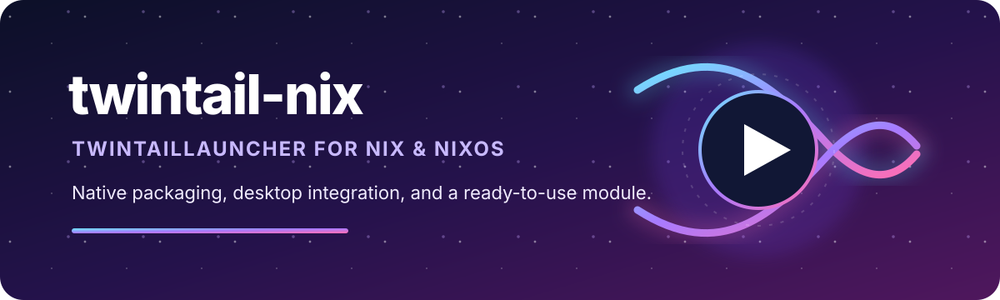

<p align="center">
  
</p>

<p align="center">
  <a href="https://github.com/madebycli/twintail-nix/actions/workflows/ci.yml"></a>
  <a href="https://github.com/madebycli/twintail-nix/actions/workflows/update-upstream.yml"></a>
  
  
</p>

<p align="center">
  Native Nix packaging and NixOS integration for
  <a href="https://github.com/TwintailTeam/TwintailLauncher">TwintailLauncher</a>.
</p>

## Quick start

Run directly:

```bash
nix run github:madebycli/twintail-nix
```

Install into the current profile:

```bash
nix profile add github:madebycli/twintail-nix#twintaillauncher
twintaillauncher
```

## What this package provides

- A native Nix package built from the official TwintailLauncher Linux release
- Desktop, GTK, networking, audio, graphics, and tray integration
- A multi-architecture Linux runtime for launcher-managed games and runners
- Gamescope, GameMode, MangoHud, Vulkan, and OpenGL support
- A NixOS module with sensible, override-friendly defaults
- Reproducible source and release pins through `flake.lock`

TwintailLauncher continues to manage its own Wine, Proton, and Steam Linux Runtime downloads. Games, runners, user settings, and account data are not included in the Nix package.

## NixOS module

Add the flake input and import the module:

```nix
{
  inputs.twintail-nix.url = "github:madebycli/twintail-nix";

  outputs = { nixpkgs, twintail-nix, ... }: {
    nixosConfigurations.example = nixpkgs.lib.nixosSystem {
      system = "x86_64-linux";
      modules = [
        twintail-nix.nixosModules.default
        {
          programs.twintaillauncher.enable = true;
        }
      ];
    };
  };
}
```

The module installs the launcher and enables the host-side graphics and gaming services required by its downloaded runners. Every default can still be overridden in the system configuration.

## Use the package directly in NixOS

Users who do not need the module can install the package explicitly:

```nix
{
  environment.systemPackages = [
    inputs.twintail-nix.packages.${pkgs.system}.twintaillauncher
  ];
}
```

## Flake outputs

```text
packages.x86_64-linux.{default,twintaillauncher}
apps.x86_64-linux.{default,twintaillauncher}
checks.x86_64-linux
nixosModules.default
overlays.default
```

## Requirements

- `x86_64-linux`
- Nix with flakes enabled, or NixOS
- A graphical Linux session
- Working native and 32-bit graphics drivers for game runners

The package is designed for Nix and NixOS. It is not a replacement installer for other Linux distributions.

## Automatic upstream updates

GitHub Actions checks the official TwintailLauncher release once per day at `01:17 UTC`. That is approximately `03:17` in Berlin during daylight-saving time and `02:17` during winter.

The same workflow can be started safely at any time from **Actions → Update upstream release → Run workflow**. A manual run does not alter the daily schedule, and workflow concurrency prevents two update runs from publishing simultaneously.

When a new or replaced release artifact is detected, the workflow:

1. resolves the official x86_64 DEB;
2. refreshes the Nix source lock and hash;
3. runs the complete flake checks;
4. builds the package;
5. verifies the installed launcher;
6. publishes the version and lock-file change only after every validation succeeds.

If the package does not build, `main` is not updated.

The helper remains available for local testing:

```bash
GITHUB_TOKEN="$(gh auth token)" python3 scripts/update.py
nix flake lock --update-input twintail_x86_64 --refresh
nix flake check --print-build-logs
nix build .#twintaillauncher --print-build-logs
```

## Development

```bash
nix flake lock
git diff --exit-code -- flake.lock
nix flake show --no-write-lock-file
nix flake check --no-write-lock-file --print-build-logs
nix build .#twintaillauncher --no-write-lock-file --print-build-logs
```

The automated checks validate the package output, launcher wrapper, multi-architecture runtime, NixOS module, and gaming integration.

## Licensing

TwintailLauncher is developed by the upstream TwintailLauncher project. This repository provides independent Nix packaging and does not redistribute games or user content.

See [`NOTICE.md`](NOTICE.md) for third-party notices and licensing details.
